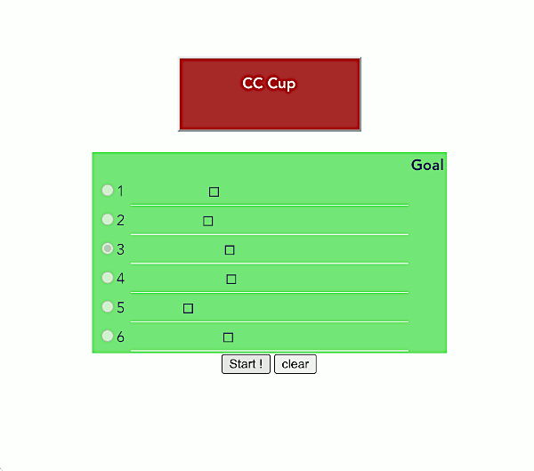

## JavaScriptでうまぽいゲーム

<table>
  <tr>
    <td></td>
    <td></td>
  </tr>
</table>

### ■ 動かすために必要なもの

 * Node.js 14+
 * Yarn v1

### ■ 遊び方

 * うまの出走するコースの中から1位を予想し、Start ! を押す
 * 走りはすべて乱数任せなので見守るだけ

### ■ 機能

 * うまを選べる
 * うまを選び直せる
 * うまの選択をキャンセルできる
 * スタートしたらうまが頑張ってゴールへ向かう様子を愛でることができる
 * 掲示板への表示とコース全体のハイライトで勝ったうまを示す
 * 自分の選択したうまが勝ったら祝福してくれる
 * 次のゲームに移行するためコースとうまおよび諸々の状態をリセットできる

### ■ 目的

 * シンプルな仕組みで遊べるものを実現する
 * 遊びながら仕組みを学ぶことができる
 * JavaScript やフロントエンド周りのツールチェインの一つの基準を示す

#### □ 学ぶことのできる仕組み

 * エディタをまたいだ設定の共有方法
 * ES 2015 および ES 2021 の class property の基本的な使い方
 * ES Modules
 * Hogan.js の基本的な使い方
 * Stimulus のやや応用的な使い方
 * ロジックだけ別な class に抽出する考え方
 * DOM Event プログラミング
 * 基本的なタイマー処理
 * ESLint, stylelint に従うことを強制する手法
 * JSDoc の書き方と生成
 * コードの依存、コールグラフの生成

#### □ 基準

 * 各種ツールチェインの設定ファイル名（すべてドットファイルとする）
 * ESLint の基本的な設定
 * stylelint の基本的な設定
 * Husky v6 のセットアップ
 * JSDoc の書き方 ( @return と @returns についてはどちらでもよい )
 * JavaScript と CSS についてはコードフォーマッタとして Prettier を利用しない（設定が衝突するので設定時間を削減するため。HTML や YAML などはその限りではないが、ここでは扱わない）

### ■ 設計方針

 1. 読み書きに必要な知識、スキルは最小限に
    * HTML, CSS, JavaScript, Stimulus, Hogan.js のみ
    * ただし JavaScript は比較的最近の仕様まで理解が要る
 2. ちゃんと遊べること
 3. 拡張性を考慮し、適切に責務を分割する
 4. JSDoc を特に責務の多い ApplicationController とロジックを担う ApplicationModel を中心に整備し、インターフェイスを意識することの大切さを示す

#### □ 採用しなかったもの

 * バックエンドが関係するとインストールの必要なものや設定の手順、状態の保存など考えることが増えるため避けた
 * VirtualDOM は component を小さくする圧力が強く、初学者の設計および実装のコストが大きいので避けた
 * TypeScript は Object に対して正しく type 指定するコストが大きいので避けた

### ■ 設計

 * **ApplicationController** アプリケーション全体の管理
    * BoardTarget 掲示板関連
        * Result
    * CongratsTarget 祝福メッセージ
    * **ApplicationModel**
 * **FieldController** コース全体を描画するだけ
    * **CourseController** コースとコース上のうまの状態を保持、描画
 * **Button** ボタンの操作と必要なタイミングでの on/off

main.js は関連するコードの単なるローダー兼 Stimulus にとってのスターター。
